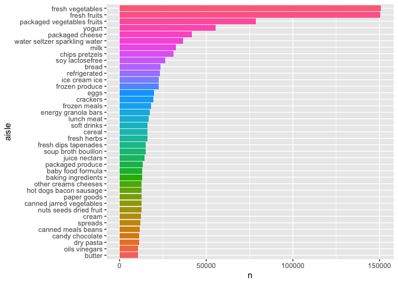

p8105_hw3_ab6169
================
Amrutha Banda
2025-10-03

``` r
library(tidyverse)
```

    ## ── Attaching core tidyverse packages ──────────────────────── tidyverse 2.0.0 ──
    ## ✔ dplyr     1.1.4     ✔ readr     2.1.5
    ## ✔ forcats   1.0.0     ✔ stringr   1.5.1
    ## ✔ ggplot2   3.5.2     ✔ tibble    3.2.1
    ## ✔ lubridate 1.9.4     ✔ tidyr     1.3.1
    ## ✔ purrr     1.0.4     
    ## ── Conflicts ────────────────────────────────────────── tidyverse_conflicts() ──
    ## ✖ dplyr::filter() masks stats::filter()
    ## ✖ dplyr::lag()    masks stats::lag()
    ## ℹ Use the conflicted package (<http://conflicted.r-lib.org/>) to force all conflicts to become errors

``` r
library(janitor)
```

    ## 
    ## Attaching package: 'janitor'
    ## 
    ## The following objects are masked from 'package:stats':
    ## 
    ##     chisq.test, fisher.test

## Problem 1

``` r
library(p8105.datasets)
data("instacart")
```

Short Description:

``` r
aisles_summary= 
  instacart |> 
  count(aisle, sort=TRUE)

aisles_summary |> 
  head(10) #This gives me a table that shows me top 10 aisles with the most ordered items 
```

    ## # A tibble: 10 × 2
    ##    aisle                              n
    ##    <chr>                          <int>
    ##  1 fresh vegetables              150609
    ##  2 fresh fruits                  150473
    ##  3 packaged vegetables fruits     78493
    ##  4 yogurt                         55240
    ##  5 packaged cheese                41699
    ##  6 water seltzer sparkling water  36617
    ##  7 milk                           32644
    ##  8 chips pretzels                 31269
    ##  9 soy lactosefree                26240
    ## 10 bread                          23635

Comments:

Making a Plot n\>10,000

``` r
aisles_summary |> 
  filter(n > 10000) |> 
  mutate(aisle = fct_reorder(aisle, n)) |> #shows me aisles based on n (size)
  ggplot(aes(x = aisle, y = n, fill = aisle)) +
  geom_col(show.legend = FALSE) +
  coord_flip() ##flips the long aisle names
```

<!-- -->

``` r
  labs(
    title = "Number of Items Ordered by Aisle (>10,000 orders)",
    x = "Aisle",
    y = "Number of Items Ordered"
  )
```

    ## $x
    ## [1] "Aisle"
    ## 
    ## $y
    ## [1] "Number of Items Ordered"
    ## 
    ## $title
    ## [1] "Number of Items Ordered by Aisle (>10,000 orders)"
    ## 
    ## attr(,"class")
    ## [1] "labels"

Comments:

Table of 3 most popular items

``` r
instacart |> 
  filter(aisle %in% 
    c("baking ingredients", "dog food care", "packaged vegetables fruits")) |> 
  group_by(aisle, product_name) |>
  summarize(n = n()) |> 
  slice_max(order_by = n, n = 3) |> 
  knitr::kable(digits = 0)
```

    ## `summarise()` has grouped output by 'aisle'. You can override using the
    ## `.groups` argument.

| aisle | product_name | n |
|:---|:---|---:|
| baking ingredients | Light Brown Sugar | 499 |
| baking ingredients | Pure Baking Soda | 387 |
| baking ingredients | Cane Sugar | 336 |
| dog food care | Snack Sticks Chicken & Rice Recipe Dog Treats | 30 |
| dog food care | Organix Chicken & Brown Rice Recipe | 28 |
| dog food care | Small Dog Biscuits | 26 |
| packaged vegetables fruits | Organic Baby Spinach | 9784 |
| packaged vegetables fruits | Organic Raspberries | 5546 |
| packaged vegetables fruits | Organic Blueberries | 4966 |

Comments:

Table of Mean Hour of the Day

``` r
instacart |> 
  filter(product_name %in% c("Pink Lady Apples", "Coffee Ice Cream")) |> 
  group_by(product_name, order_dow) |> 
  summarize(mean_hour = mean(order_hour_of_day)) |> 
  mutate(order_dow = recode(order_dow,
  `0` = "Sun",
  `1` = "Mon", 
  `2` = "Tue",
  `3` = "Wed",
  `4` = "Thu", 
  `5` = "Fri",
  `6` = "Sat")) |> 
  pivot_wider(
    names_from = order_dow,
    values_from = mean_hour ) |> 
  knitr::kable(digits=2) 
```

    ## `summarise()` has grouped output by 'product_name'. You can override using the
    ## `.groups` argument.

| product_name     |   Sun |   Mon |   Tue |   Wed |   Thu |   Fri |   Sat |
|:-----------------|------:|------:|------:|------:|------:|------:|------:|
| Coffee Ice Cream | 13.77 | 14.32 | 15.38 | 15.32 | 15.22 | 12.26 | 13.83 |
| Pink Lady Apples | 13.44 | 11.36 | 11.70 | 14.25 | 11.55 | 12.78 | 11.94 |

Comments:

## Problem 2

Cleaning

``` r
zipcodes_df= 
  read_csv("data/zipcodes.csv", na = c("NA", ".", "")) |> 
  janitor:: clean_names() 
```

    ## Rows: 322 Columns: 7
    ## ── Column specification ────────────────────────────────────────────────────────
    ## Delimiter: ","
    ## chr (4): County, County Code, File Date, Neighborhood
    ## dbl (3): State FIPS, County FIPS, ZipCode
    ## 
    ## ℹ Use `spec()` to retrieve the full column specification for this data.
    ## ℹ Specify the column types or set `show_col_types = FALSE` to quiet this message.

``` r
zori_df = 
  read_csv("data/zori.csv", na = c("NA", ".", "")) |> 
  janitor:: clean_names() |>  
    pivot_longer(
    cols = starts_with("x20"),
    names_to = "date",
    values_to = "zori"
  ) |> 
  rename(
    zip_code= region_name) |> 
  mutate(county_name= str_remove(county_name, " County")) |> 
  rename(county= county_name) |> 
  select(-city, -metro, -region_type, -state_name, -state, ) |> 
  mutate(date = sub("^x", "", date))
```

    ## Rows: 149 Columns: 125
    ## ── Column specification ────────────────────────────────────────────────────────
    ## Delimiter: ","
    ## chr   (6): RegionType, StateName, State, City, Metro, CountyName
    ## dbl (119): RegionID, SizeRank, RegionName, 2015-01-31, 2015-02-28, 2015-03-3...
    ## 
    ## ℹ Use `spec()` to retrieve the full column specification for this data.
    ## ℹ Specify the column types or set `show_col_types = FALSE` to quiet this message.

Counting Zip code observations

``` r
zip_obs = 
  zori_df |>
  group_by(zip_code) |>
  summarize(n_months = n_distinct(date), 
  .groups = "drop")

n_full = sum(zip_obs$n_months == 116)
n_under10 = sum(zip_obs$n_months < 10)
```

149 zipcodes are observed 116 times. 0 zipcodes are observed under 10
times. Some zipcodes are observed rarely due to having limited rental
listings or being in areas that are less populated. Meanwhile, other
zipcodes are shown to be observed each month because of being in
high-volume areas that are tracked by Zillow consistently.

Reader Friendly Table

There are

## Problem 3
