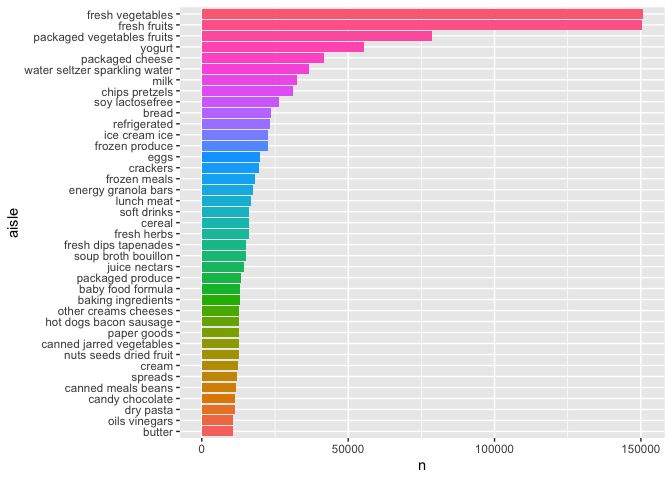

p8105_hw3_ab6169
================
Amrutha Banda
2025-10-03

## Problem 1

``` r
library(p8105.datasets)
data("instacart")
```

Short Description:

``` r
aisles_summary= 
  instacart |> 
  count(aisle, sort=TRUE)

aisles_summary |> 
  head(10) #This gives me a table that shows me top 10 aisles with the most ordered items 
```

    ## # A tibble: 10 × 2
    ##    aisle                              n
    ##    <chr>                          <int>
    ##  1 fresh vegetables              150609
    ##  2 fresh fruits                  150473
    ##  3 packaged vegetables fruits     78493
    ##  4 yogurt                         55240
    ##  5 packaged cheese                41699
    ##  6 water seltzer sparkling water  36617
    ##  7 milk                           32644
    ##  8 chips pretzels                 31269
    ##  9 soy lactosefree                26240
    ## 10 bread                          23635

Comments:

Making a Plot n\>10,000

``` r
aisles_summary |> 
  filter(n > 10000) |> 
  mutate(aisle = fct_reorder(aisle, n)) |> #shows me aisles based on n (size)
  ggplot(aes(x = aisle, y = n, fill = aisle)) +
  geom_col(show.legend = FALSE) +
  coord_flip() ##flips the long aisle names
```

<!-- -->

``` r
  labs(
    title = "Number of Items Ordered by Aisle (>10,000 orders)",
    x = "Aisle",
    y = "Number of Items Ordered"
  )
```

    ## $x
    ## [1] "Aisle"
    ## 
    ## $y
    ## [1] "Number of Items Ordered"
    ## 
    ## $title
    ## [1] "Number of Items Ordered by Aisle (>10,000 orders)"
    ## 
    ## attr(,"class")
    ## [1] "labels"

Comments:

Table of 3 most popular items

``` r
instacart |> 
  filter(aisle %in% 
    c("baking ingredients", "dog food care", "packaged vegetables fruits")) |> 
  group_by(aisle, product_name) |>
  summarize(n = n()) |> 
  slice_max(order_by = n, n = 3) |> 
  knitr::kable(digits = 0)
```

    ## `summarise()` has grouped output by 'aisle'. You can override using the
    ## `.groups` argument.

| aisle | product_name | n |
|:---|:---|---:|
| baking ingredients | Light Brown Sugar | 499 |
| baking ingredients | Pure Baking Soda | 387 |
| baking ingredients | Cane Sugar | 336 |
| dog food care | Snack Sticks Chicken & Rice Recipe Dog Treats | 30 |
| dog food care | Organix Chicken & Brown Rice Recipe | 28 |
| dog food care | Small Dog Biscuits | 26 |
| packaged vegetables fruits | Organic Baby Spinach | 9784 |
| packaged vegetables fruits | Organic Raspberries | 5546 |
| packaged vegetables fruits | Organic Blueberries | 4966 |

Comments:

Table of Mean Hour of the Day

``` r
instacart |> 
  filter(product_name %in% c("Pink Lady Apples", "Coffee Ice Cream")) |> 
  group_by(product_name, order_dow) |> 
  summarize(mean_hour = mean(order_hour_of_day)) |> 
  mutate(order_dow = recode(order_dow,
  `0` = "Sun",
  `1` = "Mon", 
  `2` = "Tue",
  `3` = "Wed",
  `4` = "Thu", 
  `5` = "Fri",
  `6` = "Sat")) |> 
  pivot_wider(
    names_from = order_dow,
    values_from = mean_hour ) |> 
  knitr::kable(digits=2) 
```

    ## `summarise()` has grouped output by 'product_name'. You can override using the
    ## `.groups` argument.

| product_name     |   Sun |   Mon |   Tue |   Wed |   Thu |   Fri |   Sat |
|:-----------------|------:|------:|------:|------:|------:|------:|------:|
| Coffee Ice Cream | 13.77 | 14.32 | 15.38 | 15.32 | 15.22 | 12.26 | 13.83 |
| Pink Lady Apples | 13.44 | 11.36 | 11.70 | 14.25 | 11.55 | 12.78 | 11.94 |

Comments:

## Problem 2

``` r
zipcodes_df= 
  read_csv("data/zipcodes.csv", na = c("NA", ".", "")) |>
  janitor::clean_names() |> 
  select(-state_fips, -file_date) |> 
  mutate(
    borough=recode(county,
          "Kings"= "Brooklyn",
          "New York"= "Manhattan",
          "Richmond"= "Staten Island") 
  ) |> 
  select(borough, county, zip_code, neighborhood)
```

    ## Rows: 322 Columns: 7
    ## ── Column specification ────────────────────────────────────────────────────────
    ## Delimiter: ","
    ## chr (4): County, County Code, File Date, Neighborhood
    ## dbl (3): State FIPS, County FIPS, ZipCode
    ## 
    ## ℹ Use `spec()` to retrieve the full column specification for this data.
    ## ℹ Specify the column types or set `show_col_types = FALSE` to quiet this message.

``` r
zori_df = 
  read_csv("data/zori.csv", na = c("NA", ".", "")) |> 
  janitor::clean_names() |> 
  pivot_longer(
    cols = starts_with("x20"),
    names_to = "date",
    values_to = "zori"
  ) |> 
  rename(
    zip_code= region_name) |> 
  mutate(county_name= str_remove(county_name, " County")) |> 
  rename(county= county_name) |> 
  select(-city, -metro, -region_type, -state_name, -state, ) |> 
  mutate(date = sub("^x", "", date))
```

    ## Rows: 149 Columns: 125
    ## ── Column specification ────────────────────────────────────────────────────────
    ## Delimiter: ","
    ## chr   (6): RegionType, StateName, State, City, Metro, CountyName
    ## dbl (119): RegionID, SizeRank, RegionName, 2015-01-31, 2015-02-28, 2015-03-3...
    ## 
    ## ℹ Use `spec()` to retrieve the full column specification for this data.
    ## ℹ Specify the column types or set `show_col_types = FALSE` to quiet this message.

``` r
#Joined DataFrame
mergezip_df=
  left_join(zipcodes_df, zori_df, by = c("zip_code","county"))
```

``` r
##Made a column for just year 
mergezip_df = 
  mergezip_df |> 
  mutate(year = as.numeric(substr(date, 1, 4)))
```

``` r
borough_year_df = 
  mergezip_df |> 
  group_by(borough, year) |> 
  summarize(
    mean_zori = mean(zori, na.rm = TRUE),
    .groups = "drop"
  ) |> 
  arrange(borough, year)
```

Reader Friendly Table

``` r
borough_year_df |> 
  knitr::kable(
    digits = 0,
    col.names = c("Borough", "Year", "Average ZORI (USD)")
  )
```

| Borough       | Year | Average ZORI (USD) |
|:--------------|-----:|-------------------:|
| Bronx         | 2015 |               1760 |
| Bronx         | 2016 |               1520 |
| Bronx         | 2017 |               1544 |
| Bronx         | 2018 |               1639 |
| Bronx         | 2019 |               1706 |
| Bronx         | 2020 |               1811 |
| Bronx         | 2021 |               1858 |
| Bronx         | 2022 |               2054 |
| Bronx         | 2023 |               2285 |
| Bronx         | 2024 |               2497 |
| Bronx         |   NA |                NaN |
| Brooklyn      | 2015 |               2493 |
| Brooklyn      | 2016 |               2520 |
| Brooklyn      | 2017 |               2546 |
| Brooklyn      | 2018 |               2547 |
| Brooklyn      | 2019 |               2631 |
| Brooklyn      | 2020 |               2555 |
| Brooklyn      | 2021 |               2550 |
| Brooklyn      | 2022 |               2868 |
| Brooklyn      | 2023 |               3015 |
| Brooklyn      | 2024 |               3127 |
| Brooklyn      |   NA |                NaN |
| Manhattan     | 2015 |               3022 |
| Manhattan     | 2016 |               3039 |
| Manhattan     | 2017 |               3134 |
| Manhattan     | 2018 |               3184 |
| Manhattan     | 2019 |               3310 |
| Manhattan     | 2020 |               3107 |
| Manhattan     | 2021 |               3137 |
| Manhattan     | 2022 |               3778 |
| Manhattan     | 2023 |               3933 |
| Manhattan     | 2024 |               4078 |
| Manhattan     |   NA |                NaN |
| Queens        | 2015 |               2215 |
| Queens        | 2016 |               2272 |
| Queens        | 2017 |               2263 |
| Queens        | 2018 |               2292 |
| Queens        | 2019 |               2388 |
| Queens        | 2020 |               2316 |
| Queens        | 2021 |               2211 |
| Queens        | 2022 |               2406 |
| Queens        | 2023 |               2562 |
| Queens        | 2024 |               2694 |
| Queens        |   NA |                NaN |
| Staten Island | 2015 |                NaN |
| Staten Island | 2016 |                NaN |
| Staten Island | 2017 |                NaN |
| Staten Island | 2018 |                NaN |
| Staten Island | 2019 |                NaN |
| Staten Island | 2020 |               1978 |
| Staten Island | 2021 |               2045 |
| Staten Island | 2022 |               2147 |
| Staten Island | 2023 |               2333 |
| Staten Island | 2024 |               2536 |
| Staten Island |   NA |                NaN |

After making the table, I did notice some trends. Manhattan continues to
have the higher average rental prices from 2015-2024. This is followed
by Brooklyn and Queens. I notice that Bronx has the most affordable
rental prices among the boroughs.

Plot: NYC Rental Prices within ZIP codes for all available years.

``` r
plot_comparison =
  mergezip_df |> 
  ggplot(aes(x = year, y = zori, color = borough)) +
  geom_point(alpha = 0.25, size = 0.8) +
  geom_smooth(se = FALSE, linewidth = 1.4) +
  labs(
    title = "NYC Rental Prices by Borough (2015–2024)",
    subtitle = "Each point represents a ZIP code; smooth lines show borough-level trends",
    x = "Year",
    y = "Average ZORI (Rent Index)",
    color = "Borough"
  ) +
  viridis::scale_color_viridis(discrete = TRUE) +
  theme_minimal(base_size = 13) +
  theme(
    legend.position = "bottom",
    plot.title = element_text(face = "bold", size = 14),
    plot.subtitle = element_text(size = 11, margin = margin(b = 10))
  )
```

Comments

Plot: distribution of ZIP-code-level rental prices across boroughs

``` r
 zip2023_df =
  mergezip_df |> 
  filter(year == 2023) |>                
  group_by(borough, zip_code) |>         
  summarize(
    mean_zori = mean(zori, na.rm = TRUE))
```

    ## `summarise()` has grouped output by 'borough'. You can override using the
    ## `.groups` argument.

``` r
plot_zip2023 =
  zip2023_df |> 
  ggplot(aes(x = borough, y = mean_zori, fill = borough)) +
  geom_violin(alpha = 0.7, trim = FALSE) +
  geom_boxplot(width = 0.12, color = "white", outlier.shape = NA) +
  labs(
    title = "Distribution of Average ZIP-Code Rental Prices by Borough (2023)",
    subtitle = "Each violin shows ZIP-level rent distribution; white boxes mark median and quartiles.",
    x = "Borough",
    y = "Average ZORI (Rent Index)",
    caption = "Data: Zillow Observed Rent Index (ZORI), Jan–Dec 2023"
  ) +
  viridis::scale_fill_viridis(discrete = TRUE) +
  theme_minimal(base_size = 12) +
  theme(
    legend.position = "none",
    plot.title = element_text(face = "bold", size = 14),
    plot.subtitle = element_text(size = 11, margin = margin(b = 10))
  )
```

Combining the two previous plots

``` r
combined_plot= 
  (plot_comparison / plot_zip2023) + plot_annotation(
    title = "NYC Rental Price Trends and 2023 Borough Distributions",
    caption = "Top: 2015–2024 trends; Bottom: 2023 ZIP-level rent distributions"
  )

ggsave("results/nyc_rental_summary.png", combined_plot,
       width = 10, height = 10, units = "in")
```

    ## `geom_smooth()` using method = 'gam' and formula = 'y ~ s(x, bs = "cs")'

    ## Warning: Removed 6893 rows containing non-finite outside the scale range
    ## (`stat_smooth()`).

    ## Warning: Failed to fit group 5.
    ## Caused by error in `smooth.construct.cr.smooth.spec()`:
    ## ! x has insufficient unique values to support 10 knots: reduce k.

    ## Warning: Removed 6893 rows containing missing values or values outside the scale range
    ## (`geom_point()`).

    ## Warning: Removed 23 rows containing non-finite outside the scale range
    ## (`stat_ydensity()`).

    ## Warning: Removed 23 rows containing non-finite outside the scale range
    ## (`stat_boxplot()`).

## Problem 3

Cleaning and Tidying Data

``` r
nhanes_accel= 
  read.csv("data/nhanes_accel.csv", na = c("NA", ".", "")) |> 
  janitor::clean_names()

##Pivoted Longer
nhanes_accel_long = 
  nhanes_accel |> 
  pivot_longer(
    cols = starts_with("min"), 
    names_to = "minute", 
    values_to = "mims") |> 
  mutate(
    minute = as.numeric(str_remove(minute, "min")))
```

``` r
nhanes_covar= 
  read.csv("data/nhanes_covar.csv", skip=4, na = c("NA", ".", "")) |> 
  janitor::clean_names() |> 
  drop_na() |> 
  filter(age>= 21) |> 
  mutate(
    sex = recode(sex, "1" = "Male", "2" = "Female"),
    education = recode(education,
      "1" = "Less than High School",
      "2" = "High School Equivalent",
      "3" = "More than High School"),
      sex = factor(sex), 
    education = factor(education, 
                       levels = c("Less than High School", 
                                  "High School Equivalent", 
                                  "More than High School")))
```

Merged Dataset

``` r
nhanes_merged = 
  left_join(nhanes_covar, nhanes_accel_long, by = "seqn")
```

Reader Friendly Table: Men and Women in Education Category

``` r
sex_edu_table =
  nhanes_covar |> 
  group_by(education, sex) |> 
  summarize(count = n()) |> 
  pivot_wider(
    names_from = sex,
    values_from = count
  )
```

    ## `summarise()` has grouped output by 'education'. You can override using the
    ## `.groups` argument.

``` r
knitr::kable(
  sex_edu_table,
  caption = "Number of Men and Women in Each Education Category",
  col.names = c("Education Level", "Men", "Women")
)
```

| Education Level        | Men | Women |
|:-----------------------|----:|------:|
| Less than High School  |  28 |    27 |
| High School Equivalent |  23 |    35 |
| More than High School  |  59 |    56 |

Number of Men and Women in Each Education Category

Comments:

The table shows roughly similar counts of men and women within each
education category. There are 12 more women than men in the “High School
Equivalent” category. There are slightly more participants in the “More
than High School” group.

Plot: Age Distributions for Men and Women in Each Education Category

``` r
plot_age_dist =
  nhanes_covar |> 
  ggplot(aes(x = age, fill = sex)) +
  geom_density(alpha = 0.5) +
  facet_wrap(~ education) +
  labs(
    title = "Age Distributions by Sex and Education Level",
    x = "Age (years)",
    y = "Density",
    fill = "Sex"
  ) +
  theme(
    legend.position = "bottom",
    plot.title = element_text(face = "bold")
  )
```

Comments:

The age distributions show that participants with higher education
levels tend to be older on average. Within each education category, the
age patterns for men and women are similar, but women appear slightly
more represented among older age groups in the “More than High School”
panel.
